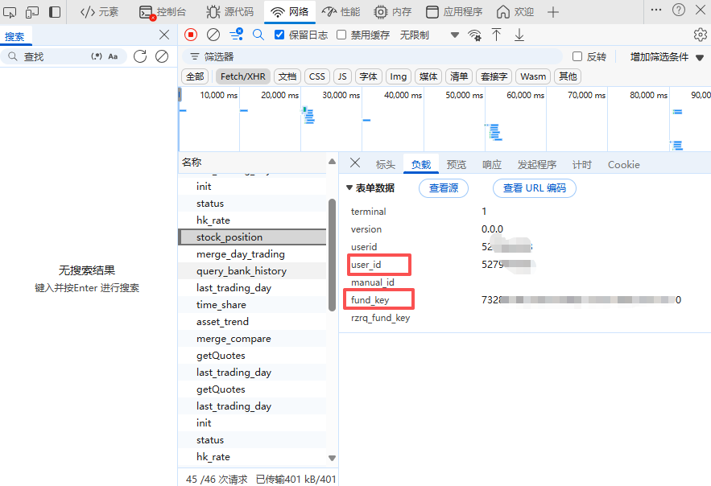
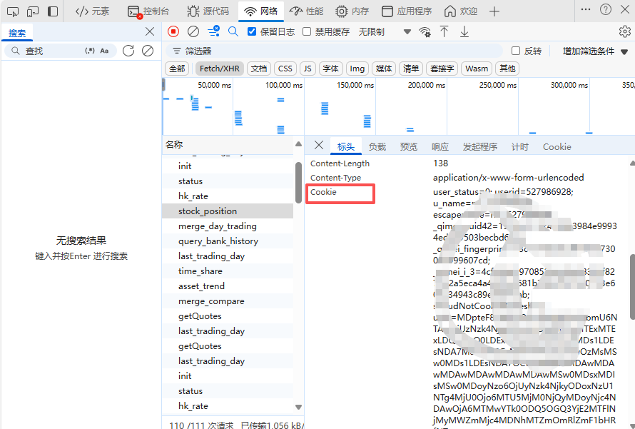
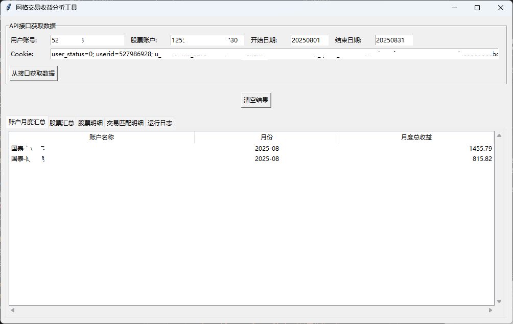
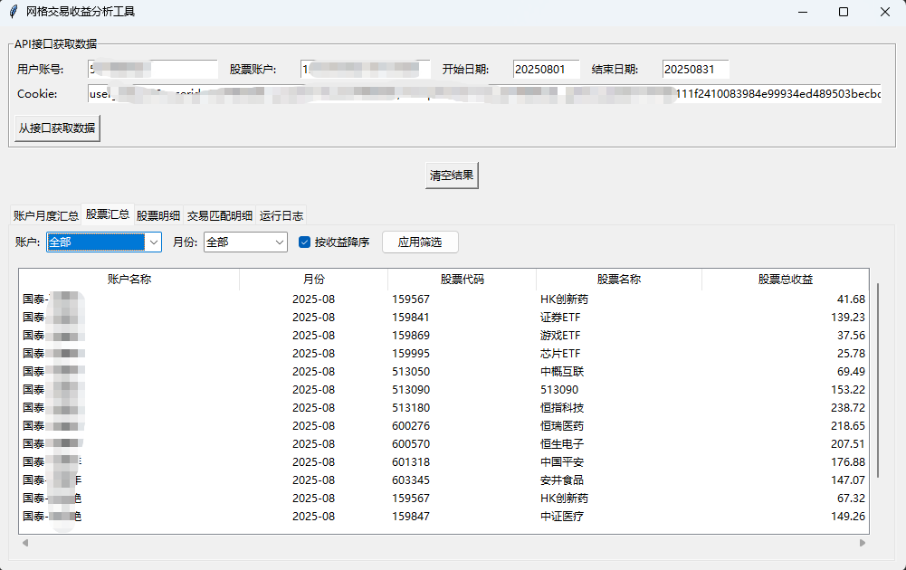
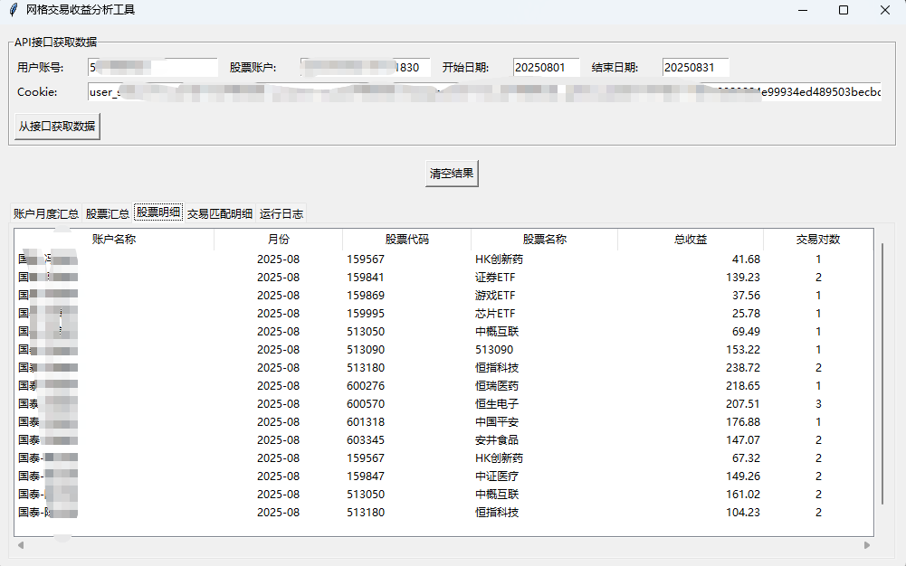
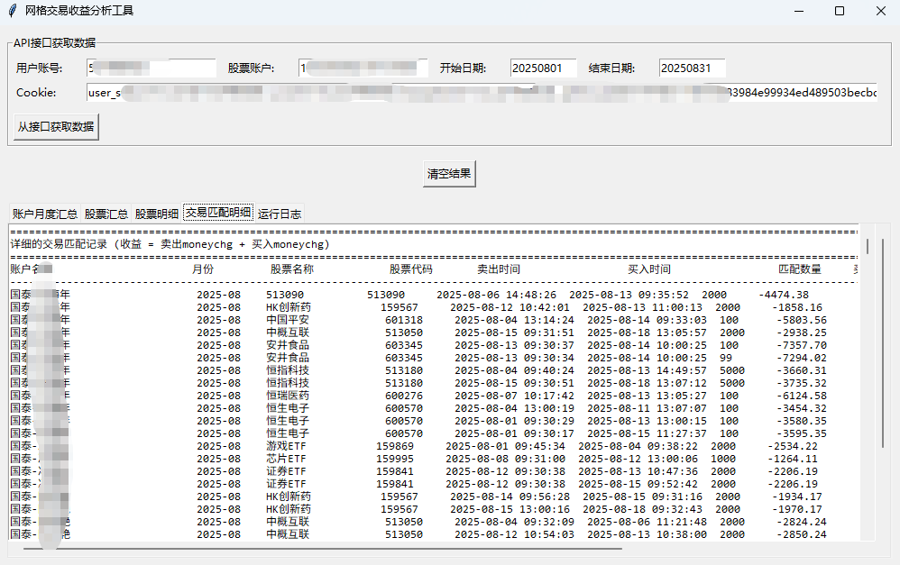

# 网格交易收益分析工具

这是一个用于分析网格交易收益的图形界面工具。它可以从API接口获取交易数据，计算网格交易的收益，并将结果导出到Excel文件。

## 项目结构

```
GridCalculator/
├── gridCalculator.py       # 主应用文件
├── data_processor.py       # 数据处理模块
├── api_client.py           # API客户端模块
├── excel_exporter.py       # Excel导出模块
├── table_manager.py        # 表格管理模块
├── requirements.txt        # 项目依赖
└── README.md              # 项目说明文档
```

## 功能特性

1. 从API接口获取交易数据

   实现原理：借助同花顺账本PC网站（https://s.hexin.cn/） 接口获取交易记录，也就是说不支持同花顺的券商是不能使用本工具的。

   工具所使用的参数需要通过浏览器抓包获取
   1. 获取用户账户(user_id)和和股票账户(fund_key)
   
   2. 获取Cookie
   

   
2. 计算网格交易收益
3. 按账户、月份和股票进行汇总分析
   
4. 生成详细的交易匹配记录
   
   
5. 将结果导出到Excel文件
6. 提供图形界面进行数据展示和筛选

## 安装依赖

```bash
pip install -r requirements.txt
```

## 使用方法

windows用户推荐直接支行dist目录下的exe文件


1. 运行主程序：
   ```bash
   python gridCalculator.py
   ```

2. 在图形界面中填写API接口参数：
   - 用户账号
   - 股票账户
   - 开始日期
   - 结束日期
   - Cookie

3. 点击"从接口获取数据"按钮开始分析

4. 查看分析结果：
   - 账户月度汇总
   - 股票汇总
   - 股票明细
   - 交易匹配明细
   - 运行日志

5. 结果会自动保存到 `网格交易收益分析结果.xlsx` 文件中

## 代码说明

### 主要模块

1. **gridCalculator.py**: 主应用文件，包含图形界面和主要的控制逻辑
2. **data_processor.py**: 数据处理模块，负责解析、预处理和分析交易数据
3. **api_client.py**: API客户端模块，负责与远程服务器通信获取数据
4. **excel_exporter.py**: Excel导出模块，负责将分析结果导出到Excel文件
5. **table_manager.py**: 表格管理模块，负责在图形界面中显示数据表格

### 数据处理流程

1. 从API获取交易数据
2. 预处理数据，标准化字段格式
3. 按账户、股票和月份分组
4. 为每个分组计算网格交易收益
5. 汇总分析结果
6. 导出到Excel文件

### 网格交易收益计算规则

- 为每个卖出记录找到时间在其之前且最近的买入记录进行匹配
- 收益 = 卖出记录的 moneychg + 买入记录的 moneychg